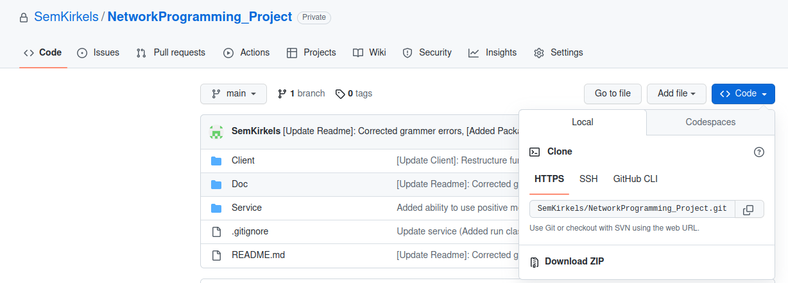
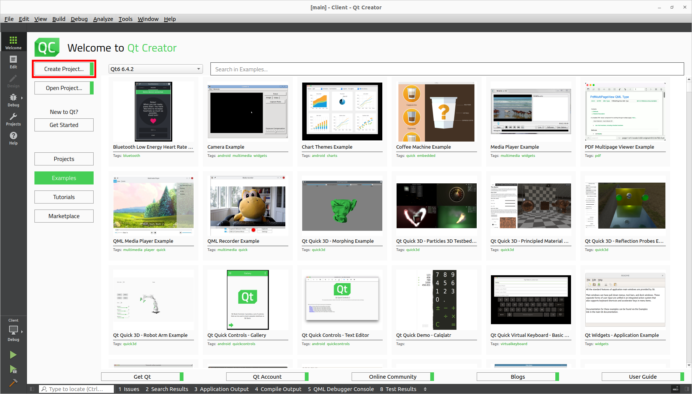
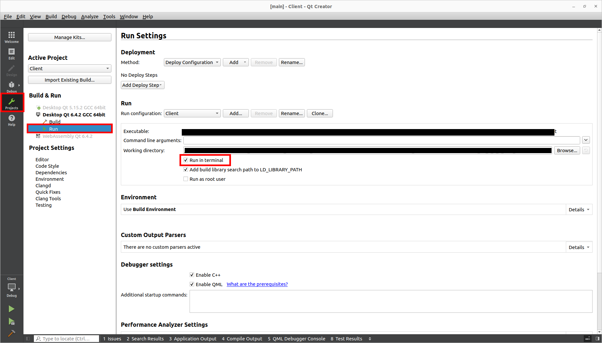
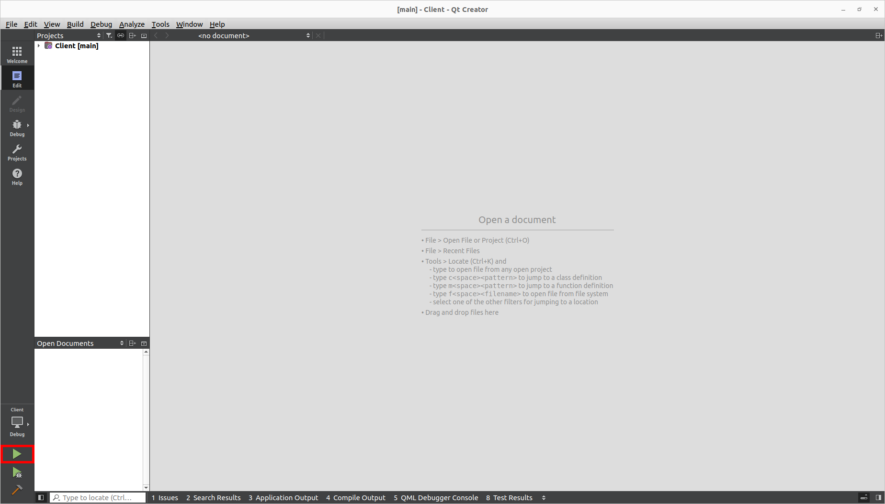

# Buildmanual
Currently, the buildmanual includes the following ways to compile the program:  
- [x] Qt Creator
- [ ] g++  
- [ ] GitHub actions  

## Supported platforms
- [x] Linux
- [ ] Windows
- [ ] MacOS

## Requirements
To run the programme, the [cppzmd library][Link_CPPZMQ] needs to be compiled and fully functional. Furthermore, it is necessary that Qt Creator is installed. Qt Creator 6.4.2 is currently the only version that guarantees 100% compatibility. Other versions may work.

# Downloading
First, it is necessary to clone or download the github repository. Cloning can be done using the following command:  
``` ./git clone https://github.com/SemKirkels/NetworkProgramming_Project.git ```  
Downloading can be done by going into the main directory of the repository. Click on the blue button ``` Code ``` and then click ``` Download ZIP ```. An image of this screen is shown below. After downloading unzip the folder in a desired location.  
  

# Installing

## Step 1
Open Qt Creator. Next, click Open Project. A navigation window opens, use this to navigate to the folder you have just downloaded or cloned. Depending on whether you want to run the client or service program, navigate to this folder and open either the ``` Client.pro ``` or ``` Service.pro ``` file.  
A new window should pop up. In this window select ``` Configure project ``` (bottom right). The project schould open up.

  

## Step 2
When the programme is open, navigate to the projects tab on the left-hand side. Click on run on the left side. Next check het box that says ``` Run in terminal ``` this makes for a more accessible interface.  
  

## Step 3
Finally clock on the Edit tab. You can now run the program by clicking on the green arrow (bottom left). A new terminal schould pop up and guide you through the program.
  

[Link_CPPZMQ]: https://github.com/zeromq/cppzmq