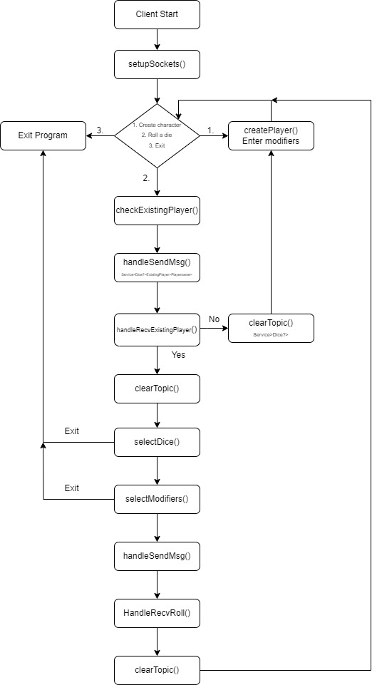
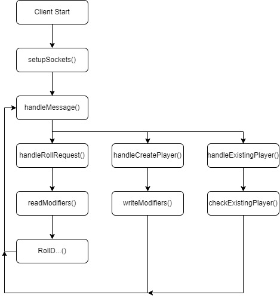

# Registration

## Register player
``` Service>Dice?>RegisterPlayer>Playername>Strength,Dexterity,Constitution,Intelligence,Wisdom,Charisma> ```  

## Player Registerd
``` Service>Dice!>PlayerName>RegisterPlayer>Reg_Player_Success> ```  

## Player not Registerd
``` Service>Dice!>PlayerName>RegisterPlayer>Reg_Player_Failed> ```

# Find existing player

## Ask if player file is found
``` Service>Dice?>PlayerName>ExistingPlayer>Playername> ```

## Reply player file is found
``` Service>Dice!>PlayerName>ExistingPlayer>Player_Found> ```

## Reply player file not found
``` Service>Dice!>PlayerName>ExistingPlayer>Player_Not_Found> ```


# Rolls

## Roll Request D4
``` Service>Dice?>Roll>Playername>Modifier>D4>```  

## Roll Request D6
``` Service>Dice?>Roll>Playername>Modifier>D6>```  

## Roll Request D8
``` Service>Dice?>Roll>Playername>Modifier>D8>```  

## Roll Request D10
``` Service>Dice?>Roll>Playername>Modifier>D10>```  

## Roll Request D12
``` Service>Dice?>Roll>Playername>Modifier>D12>```  

## Roll Request D20
``` Service>Dice?>Roll>Playername>Modifier>D20>```  

## Roll Result
``` Service>Dice!>PlayerName>4>```  
(The number can be any number)

# How does it work?
Below are two images that roughly describe the programs. The programs use the above commands to communicate with each other  
  
  
