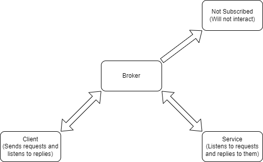
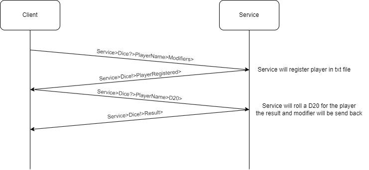

# Summary
This project provides a service for DND rolls via zero message queue (ZMQ).  

# How does it work?
The client will ask the user to create a character (if not already registered). The user will now be able to enter his modifiers. The modifiers are sent to the broker, which will forward them over the network to all devices. The service recognises a message from the client and will store the user and the modifiers. The client can now select a die. The service will then roll it and set off the modifier. The result will be sent back to the client. The client programme will display the result.

## Client

## Service

# Network diagram

So, as explained above, the client will send a message to the broker. The broker, in turn, will send this message to all devices on the network. The service will recognise this message and respond to it. If all goes well, the service will send the result of the throw back to the broker. The broker will again send this message to all network devices. Only the devices subscribed to the topic will receive the result.

A simplified version is shown in the image below.

  

## Topics
Topics are provided to ensure that other clients and services in the network are not disturbed by this service. These topics ensure that only packets to and from the service are responded to. A topic for this programme consists of:
``` Service>Dice?>Data ```  
The questionmark indicates the request from client to service.
To send something from the client to the service. The service will reply with:
``` Service>Dice!>Data ```  
The exclamation mark indicates the service's response to the client.

## Packages
A complete package consists of the topic followed by the data. Below is an example of a roll request followed by the service's reply.
The complete list of packages can be found [here.][Link_PackageList]

## Example communication
Below is an example of a standard communication between client and service. The broker has been left out of this example to make it simpler. After all, the broker is nothing more than a pass-through
  

[Link_PackageList]: https://github.com/SemKirkels/NetworkProgramming_Project/blob/main/Doc/PackageList.md